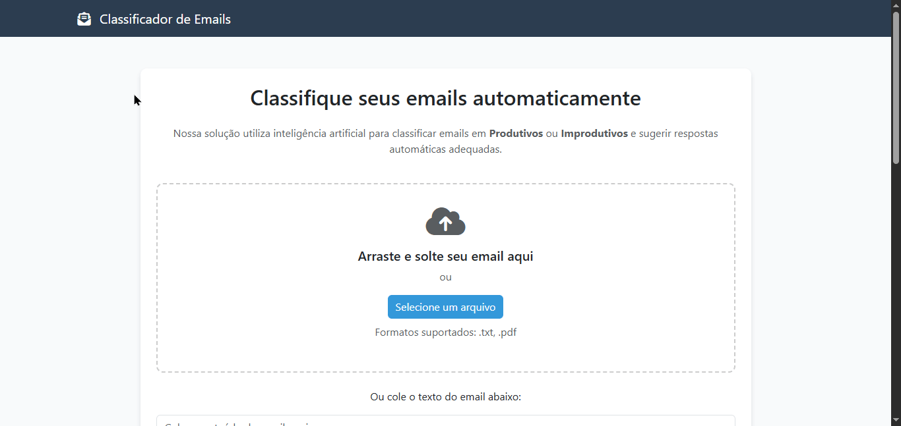

[🇺🇸 English](./README.md)   |   [🇧🇷 Português](./README-pt.md)

<div align="center"> <h1 align="center">📬 CLEAR INBOX</h1>
  <p align="center">
     Uma ferramenta inteligente de gestão de emails que classifica automaticamente suas mensagens como produtivas ou improdutivas, ajudando você a focar no que realmente importa e manter sua caixa de entrada organizada.
  </p>

   

  <p align="center"> 
  <a href="https://www.python.org/">
    
  </a>
  <a href="https://flask.palletsprojects.com/">
    
  </a> 
  <a href="./LICENSE"> 
   </a> 
   
   
  </p> 
  </div>

</div>

## 🔎 Visão Geral

O **Clear Inbox** é uma aplicação modular que permite organizar automaticamente sua caixa de entrada, classificando emails em **produtivos** e **improdutivos** usando **Machine Learning**.

> 💡 **Por que este projeto é relevante?**  
> Ajuda a aumentar a produtividade, reduzindo distrações e permitindo foco nas mensagens importantes.

### ✨ Funcionalidades Principais
- 📧 Classificação automática de emails
- 🎨 Interface limpa e intuitiva
- ⚙️ Backend em Flask com frontend HTML/CSS
- ➕ Extensível para novas funcionalidades
- 🌐 Funciona em múltiplas contas de email com segurança

---

## 📑 Sumário
- [Visão Geral](#visao-geral)
- [Demonstração](#demonstracao)
- [Tecnologias](#tecnologias-utilizadas)
- [Execução Local](#execucao-local)
- [Estrutura do Projeto](#estrutura-do-projeto)
- [Resolução de Problemas](#resolucao-de-problemas)
- [Testes](#testes)
- [Segurança](#seguranca)
- [Licença](#licenca)
- [Aprendizados](#aprendizados)
- [Como Contribuir](#como-contribuir)
- [Contato](#contato)

---

<a id="demonstracao"></a>

## 🎬 Demonstração
<p align="center"> 
    
</p>

💻 **Deploy Ativo**:
- Backend/API: https://clearinbox.onrender.com/ 

---

<a id="tecnologias-utilizadas"></a>
## 🛠️ Tecnologias Utilizadas

| Camada           | Tecnologias / Ferramentas                                |
| ---------------- | -------------------------------------------------------- |
| Frontend         | HTML, CSS                                                |
| Backend/API      | Python, Flask                                            |
| Ferramentas      | [pip](https://pip.pypa.io/), [Git](https://git-scm.com/) |
| Machine Learning | scikit-learn, pandas, numpy                              |


<a id="execucao-local"></a>
## 🚀 Execução Local

### ⚙️ Pré-requisitos

- 
- 


### ⬇️ Instalação Rápida
1️⃣ Clone o repositório:
```bash
git clone https://github.com/marcelonovello/clearInbox.git
cd clearInbox
```
2️⃣ Instale as dependências:
```bash
pip install -r requirements.txt
```
3️⃣ Execute o aplicativo:
```bash
py app.py
```
4️⃣ Acesse no navegador:
```bash
http://localhost:5000
```

---

<a id="estrutura-do-projeto"></a>

## 🏗 Estrutura do Projeto
```sh
└──📦 clearInbox/                  # Pasta raiz do projeto Clear Inbox
    ├── 📄 README.md               # Documentação principal do projeto
    ├── 📄 LICENSE                 # Arquivo de licença MIT
    ├── 📄 app.py                  # Arquivo principal do Flask (backend)
    ├── 📄 requirements.txt        # Dependências Python do projeto
    ├── 📂 static/                 # Arquivos estáticos (CSS, imagens, GIFs)
    │   ├── 📄 style.css           # Estilo CSS do frontend
    │   └── 📄 demo.gif            # GIF de demonstração da aplicação
    └── 📂 templates/              # Pastas de templates HTML do Flask
        └── 📄 index.html          # Página principal do frontend
```

---

<a id="resolucao-de-problemas"></a>
## 🔧 Resolução de Problemas

- ⚠️ **Erro de autenticação** → Verifique credenciais, 2FA e senha de app do Gmail.
- 🐛 **Limite de requisições da API** → Use intervalos maiores ou lotes menores.
- 🌐 **Problemas de conexão** → Teste outra rede e aumente timeout.
- 📧 **E-mails não encontrados** → Ajuste filtros e teste com ``--dry-run``.

---

<a id="testes"></a>

## 🧪 Testes
Execute esse comando no terminal: 
```bash
pytest
```

---

<a id="seguranca"></a>

## 🔒 Segurança
- 🔐 Nunca exponha credenciais no repositório.
- ⚡ Teste sempre em pequenos lotes com ``--dry-run`` antes de executar grandes operações.
`

---

<a id="roteiro-do-projeto"></a>
## 🗺 Roteiro do Projeto

- [X] **`Init`**: Classificação inicial de emails
- [ ] **`UI`**: Melhorias na interface
- [ ] **`Integração`**: Serviços de email reais
- [ ] **`Otimização`**: Performance e escalabilidade


---

<a id="licenca"></a>
## 📄 Licença

Licença MIT. Consulte o arquivo [LICENSE](LICENSE).

---

<a id="aprendizados"></a>
## 📚 Aprendizados
- ⚡ Integração com APIs de email
- 📱 Desenvolvimento web com Flask e HTML/CSS
- 🛠️ Boas práticas de organização de código e modularidade
- 🌐 Automação de workflows com Machine Learning

---

<a id="como-contribuir"></a>
## 🤝 Como Contribuir

Contribuições são bem-vindas! Siga os passos abaixo para colaborar com este projeto:

1. **Faça um Fork** do repositório.  
2. **Crie uma Branch** para sua feature ou correção:  
```bash
   git checkout -b my-feature
```
3. Faça as alterações necessárias no código ou na documentação.
4. Confirme as mudanças (commits) com mensagens claras:
```bash
   git commit -m "Add feature X"
```
5. Envie para seu Fork:
  ```bash
  git commit -m "Add feature X"
  ```
6. Abra um Pull Request (PR) para a branch main deste repositório.
 ```bash
 💡 Dica: Antes de enviar o PR, verifique se o código segue os padrões definidos e se todos os testes passam.
 ```

 ---

 <a id="contato"></a>
## 📬 Contato

- **Autor:** Marcelo Novello  
- **GitHub:** [marcelonovello](https://github.com/marcelonovello)  
- **LinkedIn:** [Marcelo Novello](https://www.linkedin.com/in/marcelo-novello/)

---